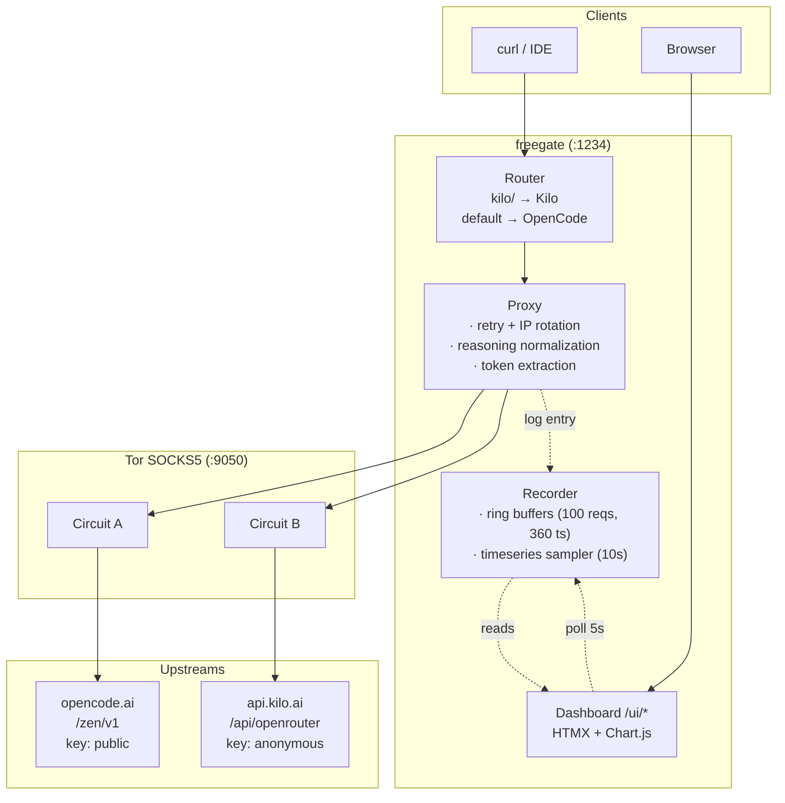

# freegate

Multi-upstream OpenAI-compatible API proxy for free AI models, routed through Tor.

freegate proxies `/v1/chat/completions` and `/v1/models` requests to **opencode.ai** and **kilo.ai** (OpenRouter), automatically routing by model ID prefix. All traffic goes through Tor SOCKS5 for anonymity. Only free models are served. Streaming responses include dual reasoning fields (`reasoning` + `reasoning_content`) for compatibility with both OpenCode and OpenRouter/Kilo clients.

## Features

- **Multi-upstream routing** — model prefix determines the upstream: `kilo/`, `kilo-`, `openrouter/` → Kilo; prefixless → OpenCode
- **Free only** — automatically filters out paid models (`isFree == true` for Kilo, `cost == "0"` for OpenCode); merged & deduped on `/v1/models`
- **Tor by default** — all upstream traffic through Tor SOCKS5 (`:9050`); 429 retries rotate Tor IP
- **Reasoning normalization** — every response (streaming + non-streaming) includes both `reasoning` and `reasoning_content` fields, regardless of upstream format
- **Token counting** — prompt/completion/total tokens extracted from upstream responses, displayed in dashboard
- **Tor IP monitoring** — current Tor circuit exit IP shown in dashboard header, refreshed every 3s
- **Rate limiting** — per-IP rate limiter, configurable via env
- **Optional auth** — API key validation via `Authorization: Bearer <key>` header
- **Read-only dashboard** — HTMX + Chart.js monitoring UI at `/ui/`
- **Mobile responsive** — dashboard adapts to small screens
- **Docker Compose** — single command to start both proxy and Tor

## Quick Start

```bash
docker compose up -d
```

The proxy will be available at `http://localhost:1234`.

A read-only dashboard is available at **http://localhost:1234/ui/** — see [Dashboard](#dashboard) below.

## Usage

```bash
# List available free models
curl http://localhost:1234/v1/models

# Chat completion (streaming)
curl -X POST http://localhost:1234/v1/chat/completions \
  -H "Content-Type: application/json" \
  -d '{"model":"openrouter/owl-alpha","messages":[{"role":"user","content":"hello"}],"max_tokens":50}'

# Chat completion (non-streaming)
curl -X POST http://localhost:1234/v1/chat/completions \
  -H "Content-Type: application/json" \
  -d '{"model":"deepseek-v4-flash-free","messages":[{"role":"user","content":"hello"}],"stream":false}'

# Health check
curl http://localhost:1234/ready
```

## Routing Rules

| Model ID pattern | Upstream | Example |
|-----------------|----------|---------|
| `kilo/...`, `kilo-...` | Kilo (OpenRouter) | `kilo-auto/free` |
| `openrouter/...` | Kilo (OpenRouter) | `openrouter/owl-alpha` |
| `nvidia/...` | Kilo (OpenRouter) | `nvidia/nemotron-3:free` |
| `poolside/...` | Kilo (OpenRouter) | `poolside/laguna-m.1:free` |
| Default (no prefix match) | OpenCode.ai | `deepseek-v4-flash-free` |

Models with `:free` suffix are also routed to Kilo.

## Configuration

All settings are environment variables:

| Variable | Default | Description |
|----------|---------|-------------|
| `PORT` | `1234` | Server port |
| `TOR_HOST` | `127.0.0.1` | Tor SOCKS host |
| `TOR_PORT` | `9050` | Tor SOCKS port |
| `TOR_CTRL_PORT` | `9051` | Tor control port |
| `TOR_PASS` | (empty) | Tor control password |
| `LOG_LEVEL` | `info` | Log level: `debug`, `info`, `warn`, `error` |
| `API_KEY` | (empty) | Optional auth key; empty = no auth |
| `RATE_LIMIT` | `60` | Requests per minute per IP |
| `UPSTREAM_URL_OPENCODE` | `https://opencode.ai/zen/v1` | OpenCode upstream URL |
| `UPSTREAM_KEY_OPENCODE` | `public` | OpenCode API key |
| `UPSTREAM_URL_KILO` | `https://api.kilo.ai/api/openrouter` | Kilo upstream URL |
| `UPSTREAM_KEY_KILO` | `anonymous` | Kilo API key |
| `UPSTREAM_DEFAULT` | `opencode` | Default upstream for unmatched models |
| `UPSTREAM_KILO_PREFIXES` | `kilo/,kilo-,openrouter/` | Comma-separated prefix list for Kilo routing |
| `UPSTREAM_REFRESH_OPENCODE` | `60` | Model refresh interval for OpenCode (seconds) |
| `UPSTREAM_REFRESH_KILO` | `60` | Model refresh interval for Kilo (seconds) |

## Reasoning Normalization

OpenCode uses `reasoning_content` for reasoning tokens; OpenRouter/Kilo use `reasoning`. freegate normalizes so both fields appear in every response:

```json
{
  "choices": [{
    "message": {
      "content": "Final answer here",
      "reasoning": "Step-by-step thought process...",
      "reasoning_content": "Step-by-step thought process..."
    }
  }]
}
```

This applies to both streaming (`delta`) and non-streaming (`message`) responses.

## API Endpoints

| Method | Path | Description |
|--------|------|-------------|
| `GET` | `/v1/models` | List all free models from all upstreams (merged, deduped) |
| `POST` | `/v1/chat/completions` | OpenAI-compatible chat completions |
| `GET` | `/v1/metrics` | Request metrics (counts per upstream, retries, errors, tokens) |
| `GET` | `/ready` | Health check |
| `GET` | `/ui/` | **Dashboard** (read-only monitoring UI, see below) |

## Dashboard

A lightweight, embedded dashboard is served at **`http://localhost:1234/ui/`**. It is built with HTMX + Chart.js, no JS framework, no SPA, no database — everything is in-memory and embedded into the single Go binary.

### Features

- **Stat cards** — total requests, retries, upstream errors, rate-limit hits, total tokens (auto-refresh 5s)
- **Requests/min chart** — line chart of the last 1 hour (10s samples, ×6 to convert to per-minute)
- **Upstream split** — opencode vs kilo counts with proportional bars
- **Free Models table** — filter by `all / opencode / kilo`, auto-refresh 10s
- **Recent Requests** — last 100 proxied requests (timestamp, model, upstream, status, duration, tokens, IP, error), auto-refresh 5s
- **Tor exit IP** — current Tor circuit IP displayed in header, refreshed every 3s
- **API Endpoints card** — quick reference for available REST endpoints
- **Health badge** — green dot when models are loaded, amber when empty
- **Mobile responsive** — adapts layout for small screens

### Endpoints used by the dashboard

| Path | Description |
|------|-------------|
| `GET /ui/` | HTML dashboard (server-rendered initial state) |
| `GET /ui/partials/stats` | HTMX fragment: 5 stat cards |
| `GET /ui/partials/requests` | HTMX fragment: recent-requests table rows |
| `GET /ui/partials/models?provider=...` | HTMX fragment: models table rows |
| `GET /ui/api/timeseries` | JSON: `[{ts, total_requests, errors, retries, rate_limit_hits, per_upstream}]` |
| `GET /ui/api/health` | JSON: `{ok, uptime, started_at, has_models, model_count, tor_ip}` |
| `GET /ui/static/{css,js}/...` | Vendored HTMX, Chart.js, dark-theme CSS |

### Notes

- **No login, no auth.** The dashboard is open. The Docker compose file binds the proxy port to `127.0.0.1:1234` so it is not exposed to the network by default.
- **In-memory only.** All counters and request history are lost on restart. The ring buffers hold at most 100 recent requests and 360 timeseries samples (1 hour at 10s cadence).
- **No persistence layer.** A future revision could add SQLite for historical requests; for now, this is a live-only monitoring surface.

## Architecture



## Project Structure

```
freegate
├── cmd/server/main.go        # Entry point
├── internal/
│   ├── config/               # Env-based config with validation
│   ├── handler/              # HTTP handlers: Chat, ListModels, Ready, Metrics
│   ├── metrics/              # Request counters + token tracking
│   ├── middleware/           # Logging, auth, rate limit, CORS, request ID
│   ├── model/                # Shared model types + request log
│   ├── proxy/                # Upstream-agnostic proxy + normalization
│   ├── respond/              # Shared HTTP response utilities
│   ├── ringbuffer/           # Generic typed ring buffer
│   ├── tor/                  # Tor controller for IP rotation + monitoring
│   ├── ui/                   # Dashboard: HTMX handlers, templates, recorder
│   └── upstream/             # Upstream interface + Router + implementations
├── web/                      # Embedded assets (templates, CSS, JS)
│   ├── templates/            # html/template sources
│   └── static/               # Vendored HTMX, Chart.js, app.css
├── docker-compose.yml        # Proxy + Tor containers
├── Dockerfile                # Multi-stage Go build
├── Dockerfile.tor            # Tor daemon with health check
└── .env.example              # Environment variable reference
```

## Development

```bash
# Build
go build -o server ./cmd/server

# Test
go test ./... -count=1

# Build Docker
docker compose build
```

## Tech Stack

- **Go 1.23+** — core proxy server
- **[chi](https://github.com/go-chi/chi/v5)** — HTTP router
- **[Tor](https://www.torproject.org/)** — SOCKS5 proxy + IP rotation on 429
- **Docker Compose** — orchestration
- **HTMX 2.x + Chart.js 4** — embedded dashboard (no JS framework, no SPA)

## Disclaimer

This project is not affiliated with OpenAI, OpenCode.ai, Kilo.ai, or any other upstream provider. It is a personal tool that routes requests to publicly available free-tier API endpoints. Users are responsible for complying with each upstream provider's terms of service. The software is provided "as is", without warranty of any kind.
