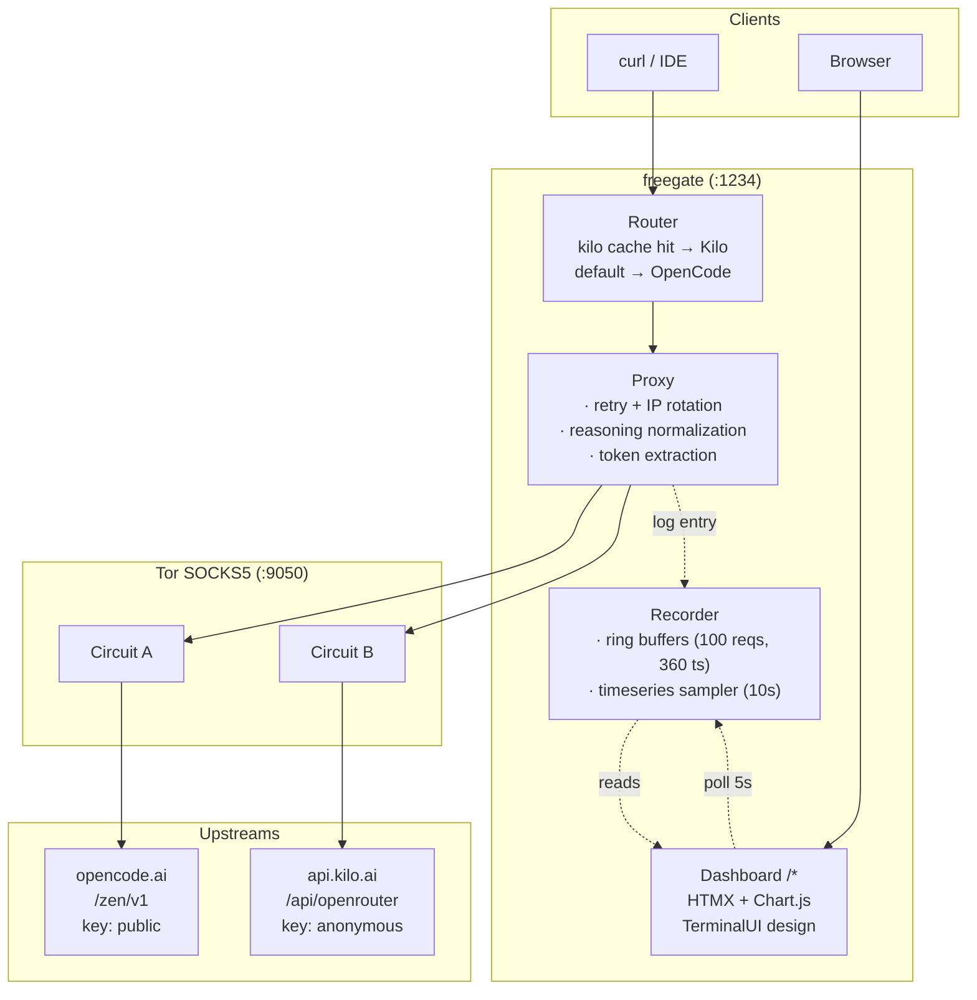

# freegate

Multi-upstream OpenAI-compatible API proxy for free AI models, routed through Tor.

freegate proxies `/v1/chat/completions` and `/v1/models` requests to **opencode.ai** and **kilo.ai** (OpenRouter), routing each request to the upstream that serves the requested model. All traffic goes through Tor SOCKS5 for anonymity. Only free models are served. Streaming responses include dual reasoning fields (`reasoning` + `reasoning_content`) for compatibility with both OpenCode and OpenRouter/Kilo clients.

## Features

- **Multi-upstream routing** — a model is served by Kilo iff it appears in Kilo's free catalog (`isFree == true` in the upstream's `/models` response); everything else falls through to OpenCode
- **Free only** — automatically filters out paid models (`isFree == true` for Kilo, `-free` suffix for OpenCode — same convention opencode uses in its own catalog); merged & deduped on `/v1/models`
- **Tor by default** — all upstream traffic through Tor SOCKS5 (`:9050`); 429 retries rotate Tor IP
- **Reasoning normalization** — every response (streaming + non-streaming) includes both `reasoning` and `reasoning_content` fields, regardless of upstream format
- **Format translation** — accepts Claude (`/v1/messages`) and native OpenAI formats; detects and translates requests to the upstream OpenAI format, then translates responses back
- **Token counting** — prompt/completion/total tokens extracted from upstream responses, displayed in dashboard
- **Tor IP monitoring** — current Tor circuit exit IP shown in dashboard header, refreshed every 3s
- **Rate limiting** — per-IP rate limiter, configurable via env
- **Optional auth** — API key validation via `Authorization: Bearer <key>` or `X-API-Key: <key>` header
- **Terminal-style dashboard** — HTMX + Chart.js monitoring UI at `http://localhost:1234/` with a phosphor-green-on-black aesthetic, JetBrains Mono typeface, and purposeful zero-radius design
- **Mobile responsive** — dashboard adapts to small screens with a compact grid layout
- **Docker Compose** — single command to start both proxy and Tor

## Quick Start

```bash
docker compose up -d
```

The proxy will be available at `http://localhost:1234`.

A read-only terminal-style dashboard is served at **`http://localhost:1234/`** — see [Dashboard](#dashboard) below.

## Usage

```bash
# List available free models
curl http://localhost:1234/v1/models

# Chat completion (streaming)
curl -X POST http://localhost:1234/v1/chat/completions \
  -H "Content-Type: application/json" \
  -d '{"model":"openrouter/owl-alpha","messages":[{"role":"user","content":"hello"}],"max_tokens":50}'

# Chat completion (non-streaming)
curl -X POST http://localhost:1234/v1/chat/completions \
  -H "Content-Type: application/json" \
  -d '{"model":"deepseek-v4-flash-free","messages":[{"role":"user","content":"hello"}],"stream":false}'

# Health check
curl http://localhost:1234/ready
```

## Routing Rules

A model ID is served by Kilo if Kilo's free catalog contains it (i.e. the upstream
returned `isFree == true` for that model). Otherwise the request is routed to
the default upstream (OpenCode).

The catalog is refreshed periodically from each upstream, so routing is driven
by upstream truth, not by a hard-coded prefix list.

## Configuration

All settings are environment variables:

| Variable | Default | Description |
|----------|---------|-------------|
| `PORT` | `1234` | Server port |
| `TOR_HOST` | `127.0.0.1` | Tor SOCKS host |
| `TOR_PORT` | `9050` | Tor SOCKS port |
| `TOR_CTRL_PORT` | `9051` | Tor control port |
| `TOR_PASS` | (empty) | Tor control password |
| `LOG_LEVEL` | `info` | Log level: `debug`, `info`, `warn`, `error` |
| `API_KEY` | (empty) | Optional auth key; empty = no auth |
| `RATE_LIMIT` | `60` | Requests per minute per IP |
| `UPSTREAM_URL_OPENCODE` | `https://opencode.ai/zen/v1` | OpenCode upstream URL |
| `UPSTREAM_KEY_OPENCODE` | `public` | OpenCode API key |
| `UPSTREAM_OPENCODE_FREE_ALLOWLIST` | `big-pickle` | Comma-separated model IDs that are free on the OpenCode upstream but don't carry the `-free` suffix |
| `UPSTREAM_URL_KILO` | `https://api.kilo.ai/api/openrouter` | Kilo upstream URL |
| `UPSTREAM_KEY_KILO` | `anonymous` | Kilo API key |
| `UPSTREAM_DEFAULT` | `opencode` | Default upstream for unmatched models |
| `UPSTREAM_REFRESH_OPENCODE` | `60` | Model refresh interval for OpenCode (seconds) |
| `UPSTREAM_REFRESH_KILO` | `60` | Model refresh interval for Kilo (seconds) |

## API Endpoints

| Method | Path | Description |
|--------|------|-------------|
| `GET` | `/v1/models` | List all free models from all upstreams (merged, deduped) |
| `POST` | `/v1/chat/completions` | OpenAI-compatible chat completions (also accepts Claude and Gemini formats) |
| `POST` | `/v1/messages` | Claude-native endpoint (auto-translated to OpenAI upstream) |
| `GET` | `/v1/metrics` | Request metrics (counts per upstream, retries, errors, tokens) |
| `GET` | `/ready` | Health check |
| `GET` | `/` | Terminal-style monitoring dashboard (see below) |

### Format Translation

freegate accepts **OpenAI**, **Claude** (`/v1/messages`), and **Gemini** request formats on `/v1/chat/completions` and `/v1/messages`. Incoming requests are detected and translated to the upstream OpenAI format; responses are translated back. Both streaming and non-streaming responses are supported.

### Reasoning Normalization

OpenCode uses `reasoning_content` for reasoning tokens; OpenRouter/Kilo use `reasoning`. freegate normalizes so both fields appear in every response:

```json
{
  "choices": [{
    "message": {
      "content": "Final answer here",
      "reasoning": "Step-by-step thought process...",
      "reasoning_content": "Step-by-step thought process..."
    }
  }]
}
```

This applies to both streaming (`delta`) and non-streaming (`message`) responses.

## Dashboard

A lightweight, embedded terminal-style dashboard is served at **`http://localhost:1234/`** (mounted at the root). It uses HTMX for live partial updates and Chart.js for the timeseries line chart — no JavaScript framework, no SPA, no database. Everything is in-memory and embedded into the single Go binary.

### Design

The dashboard follows the **TerminalUI** design system:
- Dark canvas (`#0D0D0D`), phosphor green (`#00FF41`) brand accent
- **JetBrains Mono** throughout — self-hosted WOFF2 in four weights (400 / 500 / 600 / 700)
- Zero border radius on all elements
- Borders and dashed ASCII-style dividers instead of shadows for hierarchy
- Transparent buttons that invert (green text → green background on hover)
- Uppercase pill badges with colored borders
- CLI comment `//` prefix on descriptions and `$` / `#` prefixes on headings
- All transitions are instant (`step-start`, no easing curves)

### Features

- **Stat blocks** — total requests, retries, upstream errors, rate-limit hits, total tokens (auto-refresh 5s)
- **Requests/min chart** — line chart of the last 1 hour (10s samples, ×6 to convert to per-minute)
- **Upstream split** — opencode vs kilo counts with proportional bars
- **Free Models table** — filter by `all / opencode / kilo`, auto-refresh 10s
- **Recent Requests** — last 100 proxied requests (timestamp, model, upstream, status, duration, tokens, IP, error), auto-refresh 5s
- **Tor exit IP** — current Tor circuit IP displayed in header, refreshed every 3s
- **API Endpoints card** — quick reference for available REST endpoints
- **Health badge** — green square dot when models are loaded, amber when empty
- **Mobile responsive** — adapts layout for small screens (compact nav grid, 2-col metrics, tighter spacing)

### Endpoints used by the dashboard

| Path | Description |
|------|-------------|
| `GET /` | HTML dashboard (server-rendered initial state) |
| `GET /partials/stats` | HTMX partial: 5 metric cards (requests, retries, errors, rate-limit hits, tokens) |
| `GET /partials/requests` | HTMX partial: last 100 proxied requests table |
| `GET /partials/models` | HTMX partial: free-models table; filter via `?provider=all\|opencode\|kilo` |
| `GET /api/timeseries` | JSON: `[{ts, total_requests, errors, retries, rate_limit_hits, per_upstream}]` |
| `GET /api/health` | JSON: `{ok, uptime, started_at, has_models, model_count, tor_ip}` |
| `GET /static/*` | Self-hosted static assets (CSS, HTMX, Chart.js, JetBrains Mono, favicon) |
| `GET /index.html` | Redirects to `/` |

### Notes

- **No login, no auth.** The dashboard is open. The Docker compose file binds the proxy port to `127.0.0.1:1234` so it is not exposed to the network by default.
- **In-memory only.** All counters and request history are lost on restart. The ring buffers hold at most 100 recent requests and 360 timeseries samples (1 hour at 10s cadence).
- **No persistence layer.** A future revision could add SQLite for historical requests; for now, this is a live-only monitoring surface.

## Architecture



## Project Structure

```
freegate
├── cmd/server/main.go        # Entry point
├── internal/
│   ├── application/          # Use cases: ChatService (retry, IP rotation), ModelService
│   ├── config/               # Env-based config with validation
│   ├── delivery/             # HTTP-facing layer
│   │   ├── handler/          # HTTP handlers: Chat, ListModels, Ready, Metrics
│   │   ├── middleware/       # Logging, auth, rate limit, CORS, request ID
│   │   ├── respond/          # Shared HTTP response utilities
│   │   └── ui/               # Dashboard: HTMX handlers, templates, static assets
│   ├── domain/               # Core domain types (ChatRequest, Upstream, UpstreamRouter, etc.)
│   ├── httputil/             # HTTP helpers: header parsing, IP extraction, conversion
│   ├── infrastructure/       # Out-of-process integrations
│   │   ├── metrics/          # Request counters + token tracking
│   │   ├── proxy/            # Upstream-agnostic normalization helpers
│   │   ├── recorder/         # Request log + timeseries sampler
│   │   ├── ringbuffer/       # Generic typed ring buffer
│   │   ├── tor/              # Tor controller for IP rotation + monitoring
│   │   └── upstream/         # Upstream interface + Router + implementations
│   ├── model/                # Shared data types (request log entries, timeseries entries)
│   ├── server/               # HTTP server bootstrap (wiring + lifecycle)
│   └── translate/            # Format translation: Claude, Gemini detect + request/response
├── web/                      # Embedded assets (templates, CSS, JS, fonts)
│   ├── templates/
│   │   ├── dashboard.html    # Main page
│   │   └── partials/         # HTMX partial fragments (stats, requests, models)
│   ├── static/
│   │   ├── css/app.css       # TerminalUI design system
│   │   ├── js/               # Vendored HTMX 2.x + Chart.js 4.x
│   │   ├── fonts/            # Self-hosted JetBrains Mono (Latin, 4 weights)
│   │   └── favicon.svg       # Terminal-style favicon
│   └── embed.go              # go:embed directives
├── docker-compose.yml        # Proxy + Tor containers
├── Dockerfile                # Multi-stage Go build
├── Dockerfile.tor            # Tor daemon with health check
├── Makefile                  # test, build, docker compose targets
└── .env.example              # Environment variable reference
```

## Development

A `Makefile` wraps the common workflows. Run `make help` for the full list.

```bash
# Common targets
make test         # run all tests
make test-v       # run tests (verbose)
make test-cover   # run tests with coverage report
make build        # build the server binary -> ./server
make run          # run the server locally
make vet          # go vet
make fmt          # gofmt
make check        # fmt + vet + test

# Docker Compose
make up           # docker compose up -d
make down         # docker compose down
make logs svc=proxy
make ps
make clean        # stop services and remove build artifacts
```

The same targets are also available directly:

```bash
# Build
go build -o server ./cmd/server

# Test
go test ./... -count=1

# Build Docker
docker compose build
```

## Tech Stack

- **Go 1.26+** — core proxy server
- **[chi](https://github.com/go-chi/chi/v5)** — HTTP router
- **[Tor](https://www.torproject.org/)** — SOCKS5 proxy + IP rotation on 429
- **Docker Compose** — orchestration
- **HTMX 2.x + Chart.js 4** — embedded dashboard (no JS framework, no SPA)
- **JetBrains Mono** — terminal-inspired monospace typeface (self-hosted WOFF2)
- **TerminalUI** — green-on-black design system (zero radius, no shadows, instant transitions)

## Disclaimer

This project is not affiliated with OpenAI, OpenCode.ai, Kilo.ai, or any other upstream provider. It is a personal tool that routes requests to publicly available free-tier API endpoints. Users are responsible for complying with each upstream provider's terms of service. The software is provided "as is", without warranty of any kind.
