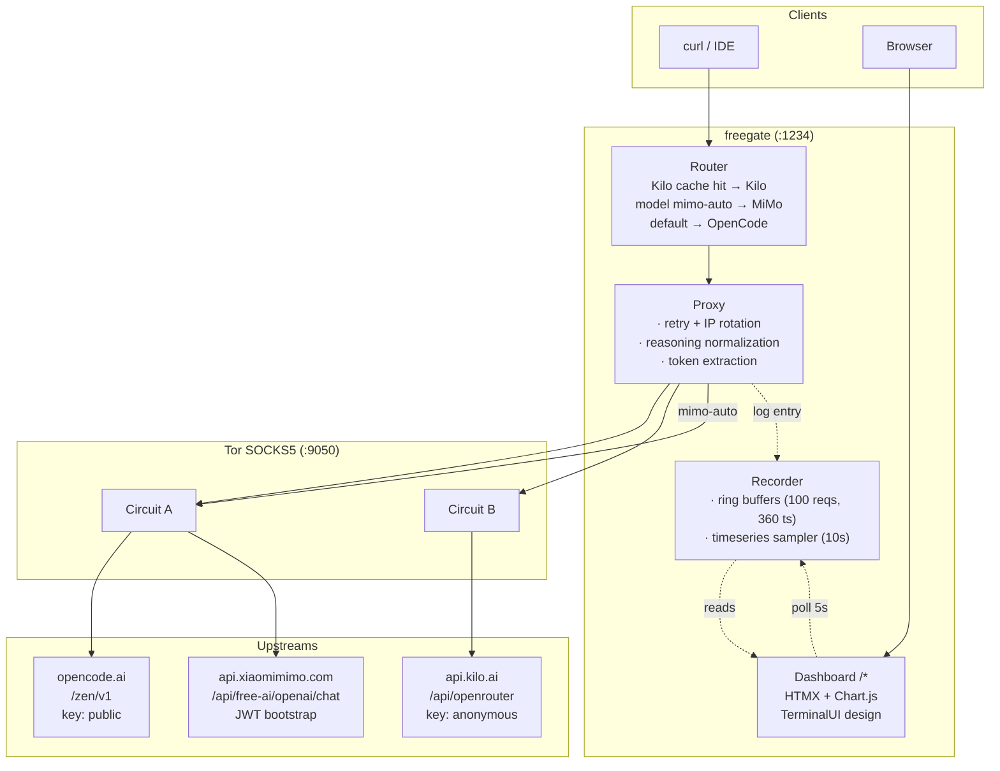

# freegate

Multi-upstream OpenAI-compatible API proxy for free AI models, routed through Tor.

freegate proxies `/v1/chat/completions` and `/v1/models` requests to **opencode.ai**, **kilo.ai** (OpenRouter), and **Xiaomi MiMo Free**, routing each request to the upstream that serves the requested model. All traffic goes through Tor SOCKS5 for anonymity. Only free models are served. Streaming responses normalize the upstream's `reasoning_content` field (used by OpenCode/DeepSeek) into the standard `reasoning` field so clients see a single reasoning field.

## Features

- **Multi-upstream routing** — a model is served by Kilo iff it appears in Kilo's free catalog (`isFree == true` in the upstream's `/models` response); MiMo serves the `mimo-auto` model; everything else falls through to OpenCode
- **Free only** — automatically filters out paid models (`isFree == true` for Kilo, `-free` suffix for OpenCode — same convention opencode uses in its own catalog); merged & deduped on `/v1/models`
- **Tor by default** — all upstream traffic through Tor SOCKS5 (`:9050`); 429 retries rotate Tor IP. Set `BYPASS_PROXY=true` to disable Tor and go direct
- **Reasoning normalization** — collapses upstream `reasoning_content` (OpenCode/DeepSeek) into a single `reasoning` field, preventing the double-response seen on DeepSeek when both fields are present
- **Format translation** — accepts Claude (`/v1/messages`) and native OpenAI formats; detects and translates requests to the upstream OpenAI format, then translates responses back
- **Token counting** — prompt/completion/total tokens extracted from upstream responses, displayed in dashboard
- **Tor IP monitoring** — current Tor circuit exit IP shown in dashboard header, refreshed every 3s
- **Rate limiting** — per-IP rate limiter, configurable via env
- **Optional auth** — API key validation via `Authorization: Bearer <key>` or `X-API-Key: <key>` header
- **Terminal-style dashboard** — HTMX + Chart.js monitoring UI at `http://localhost:1234/` with a phosphor-green-on-black aesthetic, JetBrains Mono typeface, and purposeful zero-radius design
- **Chat playground** — in-dashboard chat UI with model picker, system prompt, and persistent thread; opens from the nav and posts to the same `/v1/chat/completions` proxy (non-streaming via HTMX; streaming is a planned follow-up)
- **Mobile responsive** — dashboard adapts to small screens with a compact grid layout
- **Docker Compose** — single command to start both proxy and Tor

## Quick Start

```bash
docker compose up -d
```

The proxy will be available at `http://localhost:1234`.

A read-only terminal-style dashboard is served at **`http://localhost:1234/`** — see [Dashboard](#dashboard) below.

## Usage

```bash
# List available free models
curl http://localhost:1234/v1/models

# Chat completion (streaming)
curl -X POST http://localhost:1234/v1/chat/completions \
  -H "Content-Type: application/json" \
  -d '{"model":"openrouter/owl-alpha","messages":[{"role":"user","content":"hello"}],"max_tokens":50}'

# Chat completion (non-streaming)
curl -X POST http://localhost:1234/v1/chat/completions \
  -H "Content-Type: application/json" \
  -d '{"model":"deepseek-v4-flash-free","messages":[{"role":"user","content":"hello"}],"stream":false}'

# Health check
curl http://localhost:1234/ready
```

## Routing Rules

A model ID is served by:
- **Kilo** — if Kilo's free catalog contains it (`isFree == true`)
- **MiMo** — if the model ID is `mimo-auto`
- **OpenCode** — everything else (default upstream)

The catalog is refreshed periodically from each upstream, so routing is driven
by upstream truth, not by a hard-coded prefix list.

## Configuration

All settings are environment variables:

| Variable | Default | Description |
|----------|---------|-------------|
| `PORT` | `1234` | Server port |
| `TOR_HOST` | `127.0.0.1` | Tor SOCKS host |
| `TOR_PORT` | `9050` | Tor SOCKS port |
| `TOR_CTRL_PORT` | `9051` | Tor control port |
| `TOR_PASS` | (empty) | Tor control password |
| `BYPASS_PROXY` | `false` | Set to `true` to bypass Tor entirely — direct connections, no IP rotation on 429 |
| `LOG_LEVEL` | `info` | Log level: `debug`, `info`, `warn`, `error` |
| `API_KEY` | (empty) | Optional auth key; empty = no auth |
| `RATE_LIMIT` | `60` | Requests per minute per IP |
| `UPSTREAM_URL_OPENCODE` | `https://opencode.ai/zen/v1` | OpenCode upstream URL |
| `UPSTREAM_KEY_OPENCODE` | `public` | OpenCode API key |
| `UPSTREAM_OPENCODE_FREE_ALLOWLIST` | `big-pickle` | Comma-separated model IDs that are free on the OpenCode upstream but don't carry the `-free` suffix |
| `UPSTREAM_URL_KILO` | `https://api.kilo.ai/api/openrouter` | Kilo upstream URL |
| `UPSTREAM_KEY_KILO` | `anonymous` | Kilo API key |
| `UPSTREAM_DEFAULT` | `opencode` | Default upstream for unmatched models |
| `UPSTREAM_REFRESH_OPENCODE` | `60` | Model refresh interval for OpenCode (seconds) |
| `UPSTREAM_REFRESH_KILO` | `60` | Model refresh interval for Kilo (seconds) |
| `UPSTREAM_URL_MIMO` | `https://api.xiaomimimo.com/api/free-ai/openai/chat` | MiMo Free upstream URL |
| `UPSTREAM_REFRESH_MIMO` | `300` | Model refresh interval for MiMo (seconds; JWT expiry-based) |

## API Endpoints

| Method | Path | Description |
|--------|------|-------------|
| `GET` | `/v1/models` | List all free models from all upstreams (merged, deduped) |
| `POST` | `/v1/chat/completions` | OpenAI-compatible chat completions (also accepts Claude and Gemini formats) |
| `POST` | `/v1/messages` | Claude-native endpoint (auto-translated to OpenAI upstream) |
| `GET` | `/v1/metrics` | Request metrics (counts per upstream, retries, errors, tokens) |
| `GET` | `/ready` | Health check |
| `GET` | `/` | Terminal-style monitoring dashboard (see below) |

### Format Translation

freegate accepts **OpenAI**, **Claude** (`/v1/messages`), and **Gemini** request formats on `/v1/chat/completions` and `/v1/messages`. Incoming requests are detected and translated to the upstream OpenAI format; responses are translated back. Both streaming and non-streaming responses are supported.

Detection is structural (no URL path needed) and ordered:

1. **Gemini** — top-level `contents` array with no `messages` key
2. **Claude** — `messages` plus a Claude-specific hint (`anthropic_version`, top-level `max_tokens`, a `system` prompt, or `tool_use` / `tool_result` / `image` content blocks)
3. **OpenAI** — default

### Request Limits & Middleware

- **Request body limit:** 10 MB (`MaxRequestBodySize` in `internal/delivery/handler/chat.go`); oversized bodies are rejected with HTTP 413.
- **CORS:** wildcard `Access-Control-Allow-Origin: *` plus `OPTIONS` short-circuit on every route, so browser clients can call the proxy from any origin.
- **Request ID:** every request gets an `X-Request-ID` (echoed if the client sent one, otherwise an 8-byte hex value); included in logs and the recent-requests table.
- **Error format:** OpenAI-compatible `{"error":{"type","message"}}` envelope used for all `4xx` / `5xx` responses.

### Reasoning Normalization

OpenCode and DeepSeek stream their reasoning tokens in the `reasoning_content` field; OpenRouter/Kilo use `reasoning`. freegate collapses both into a single `reasoning` field so the client only ever sees one:

```json
{
  "choices": [{
    "message": {
      "content": "Final answer here",
      "reasoning": "Step-by-step thought process..."
    }
  }]
}
```

This applies to both streaming (`delta`) and non-streaming (`message`) responses. The upstream `reasoning_content` is always dropped, so clients that render `reasoning` (or `reasoning_content`) do not see the thinking text twice.

## Dashboard

A lightweight, embedded terminal-style dashboard is served at **`http://localhost:1234/`** (mounted at the root). It uses HTMX for live partial updates and Chart.js for the timeseries line chart — no JavaScript framework, no SPA, no database. Everything is in-memory and embedded into the single Go binary.

### Design

The dashboard follows the **TerminalUI** design system:
- Dark canvas (`#0D0D0D`), phosphor green (`#00FF41`) brand accent
- **JetBrains Mono** throughout — self-hosted WOFF2 in four weights (400 / 500 / 600 / 700)
- Zero border radius on all elements
- Borders and dashed ASCII-style dividers instead of shadows for hierarchy
- Transparent buttons that invert (green text → green background on hover)
- Uppercase pill badges with colored borders
- CLI comment `//` prefix on descriptions and `$` / `#` prefixes on headings
- All transitions are instant (`step-start`, no easing curves)

### Features

- **Stat blocks** — total requests, retries, upstream errors, rate-limit hits, total tokens (auto-refresh 5s)
- **Requests/min chart** — line chart of the last 1 hour (10s samples, ×6 to convert to per-minute)
- **Upstream split** — opencode, kilo, and mimo-free counts with proportional bars
- **Free Models table** — filter by `all / opencode / kilo`, auto-refresh 10s
- **Recent Requests** — last 100 proxied requests (timestamp, model, upstream, status, duration, tokens, IP, error), auto-refresh 5s
- **Tor exit IP** — current Tor circuit IP displayed in header, refreshed every 3s
- **API Endpoints card** — quick reference for available REST endpoints
- **Health badge** — green square dot when models are loaded, amber when empty
- **Mobile responsive** — adapts layout for small screens (compact nav grid, 2-col metrics, tighter spacing)

### Endpoints used by the dashboard

| Path | Description |
|------|-------------|
| `GET /` | HTML dashboard (server-rendered initial state) |
| `GET /partials/stats` | HTMX partial: 5 metric cards (requests, retries, errors, rate-limit hits, tokens) |
| `GET /partials/requests` | HTMX partial: last 100 proxied requests table |
| `GET /partials/models` | HTMX partial: free-models table; filter via `?provider=all\|opencode\|kilo\|mimo-free` |
| `GET /api/timeseries` | JSON: `[{ts, total_requests, errors, retries, rate_limit_hits, per_upstream}]` |
| `GET /api/health` | JSON: `{ok, uptime, started_at, has_models, model_count, tor_ip}` |
| `GET /static/*` | Self-hosted static assets (CSS, HTMX, Chart.js, JetBrains Mono, favicon) |
| `GET /index.html` | Redirects to `/` |

### Notes

- **No login, no auth.** The dashboard is open. The Docker compose file binds the proxy port to `127.0.0.1:1234` so it is not exposed to the network by default.
- **In-memory only.** All counters and request history are lost on restart. The ring buffers hold at most 100 recent requests and 360 timeseries samples (1 hour at 10s cadence).
- **No persistence layer.** A future revision could add SQLite for historical requests; for now, this is a live-only monitoring surface.

## Playground

The dashboard includes an embedded **chat playground** — a modal chat UI served by the same `web/static/js/playground.js` bundle that the dashboard already loads. Open it from the **> playground** button in the nav.

- **Model picker** — populated from `GET /v1/models` (auto-loaded on first open; refreshes on demand)
- **System prompt** — collapsible; persists with the thread in `localStorage`
- **Stream toggle** — switches between SSE streaming and one-shot responses
- **Multi-turn thread** — keep the conversation going; full history is sent with each request
- **Persistence** — the thread survives page reloads via `localStorage` (key: `freegate.playground.v1`); "clear" wipes it
- **Shortcuts** — `Enter` sends, `Shift+Enter` inserts a newline
- **No auth on the dashboard mount** — the playground honors the same `API_KEY` as the API: the modal calls `/v1/chat/completions`, so if `API_KEY` is set the browser will need to include the same `Authorization: Bearer <key>` / `X-API-Key: <key>` header (e.g. via a browser extension)

Internally the playground is **HTMX-driven** with a small JS shim for client-side state. The form posts to `/v1/chat/completions` via `hx-post`, the model picker loads via `hx-get="/partials/playground/models"`, and event hooks (`hx-on:htmx:after-request`, etc.) hand responses off to the shim. The modal markup lives in `web/templates/partials/playground_modal.html` (rendered into `dashboard.html` via a `{{template}}` directive), the option-list partial in `web/templates/partials/playground_models.html`, the server route at `internal/delivery/ui/handler.go` (`/partials/playground/models`), and the shim in `web/static/js/playground.js`. **Streaming is not yet implemented** in this version — the form sends `stream: false` and waits for the full response. A streaming follow-up is tracked.

## Architecture



## Project Structure

```
freegate
├── cmd/server/main.go        # Entry point
├── internal/
│   ├── application/          # Use cases: ChatService (retry, IP rotation), ModelService
│   ├── config/               # Env-based config with validation
│   ├── delivery/             # HTTP-facing layer
│   │   ├── handler/          # HTTP handlers: Chat, ListModels, Ready, Metrics
│   │   ├── middleware/       # Logging, auth, rate limit, CORS, request ID
│   │   ├── respond/          # Shared HTTP response utilities
│   │   └── ui/               # Dashboard: HTMX handlers, templates, static assets
│   ├── domain/               # Core domain types (ChatRequest, Upstream, UpstreamRouter, etc.)
│   ├── httputil/             # HTTP helpers: header parsing, IP extraction, conversion
│   ├── infrastructure/       # Out-of-process integrations
│   │   ├── metrics/          # Request counters + token tracking
│   │   ├── proxy/            # Upstream-agnostic normalization helpers
│   │   ├── recorder/         # Request log + timeseries sampler
│   │   ├── ringbuffer/       # Generic typed ring buffer
│   │   ├── tor/              # Tor controller for IP rotation + monitoring
│   │   └── upstream/         # Upstream interface + Router + implementations (opencode, kilo, mimo)
│   ├── model/                # Shared data types (request log entries, timeseries entries)
│   ├── server/               # HTTP server bootstrap (wiring + lifecycle)
│   └── translate/            # Format translation: Claude, Gemini detect + request/response
├── web/                      # Embedded assets (templates, CSS, JS, fonts)
│   ├── templates/
│   │   ├── dashboard.html    # Main page (includes playground modal via {{template}})
│   │   └── partials/         # HTMX partial fragments (stats, requests, models, playground modal + playground model options)
│   ├── static/
│   │   ├── css/app.css       # TerminalUI design system
│   │   ├── js/               # Vendored HTMX 2.x + Chart.js 4.x + playground.js
│   │   ├── fonts/            # Self-hosted JetBrains Mono (Latin, 4 weights)
│   │   └── favicon.svg       # Terminal-style favicon
│   └── embed.go              # go:embed directives
├── docker-compose.yml        # Proxy + Tor containers
├── Dockerfile                # Multi-stage Go build
├── Dockerfile.tor            # Tor daemon with health check
├── Makefile                  # test, build, docker compose targets
└── .env.example              # Environment variable reference
```

## Development

A `Makefile` wraps the common workflows. Run `make help` for the full list.

```bash
# Common targets
make test         # run all tests
make test-v       # run tests (verbose)
make test-cover   # run tests with coverage report (writes coverage.html)
make test-race    # run tests with the race detector
make test-one name=TestFoo  # run a single test by name
make build        # build the server binary -> ./server
make run          # run the server locally
make vet          # go vet
make fmt          # gofmt
make check        # fmt + vet + test
make tidy         # go mod tidy

# Docker Compose
make up             # docker compose up -d
make down           # docker compose down
make restart        # docker compose restart
make logs svc=proxy # tail a service's logs
make ps             # list running services
make ps-all         # list all services including stopped
make rebuild svc=proxy  # rebuild and restart a service
make compose-build  # build service images
make compose-pull   # pull service images
make clean          # docker compose down -v + remove build artifacts
```

The same targets are also available directly:

```bash
# Build
go build -o server ./cmd/server

# Test
go test ./... -count=1

# Build Docker
docker compose build
```

## Tech Stack

- **Go 1.26+** — core proxy server
- **[chi](https://github.com/go-chi/chi/v5)** — HTTP router
- **[Tor](https://www.torproject.org/)** — SOCKS5 proxy + IP rotation on 429
- **Docker Compose** — orchestration
- **HTMX 2.x + Chart.js 4** — embedded dashboard (no JS framework, no SPA)
- **JetBrains Mono** — terminal-inspired monospace typeface (self-hosted WOFF2)
- **TerminalUI** — green-on-black design system (zero radius, no shadows, instant transitions)

## Disclaimer

This project is not affiliated with OpenAI, OpenCode.ai, Kilo.ai, or any other upstream provider. It is a personal tool that routes requests to publicly available free-tier API endpoints. Users are responsible for complying with each upstream provider's terms of service. The software is provided "as is", without warranty of any kind.
