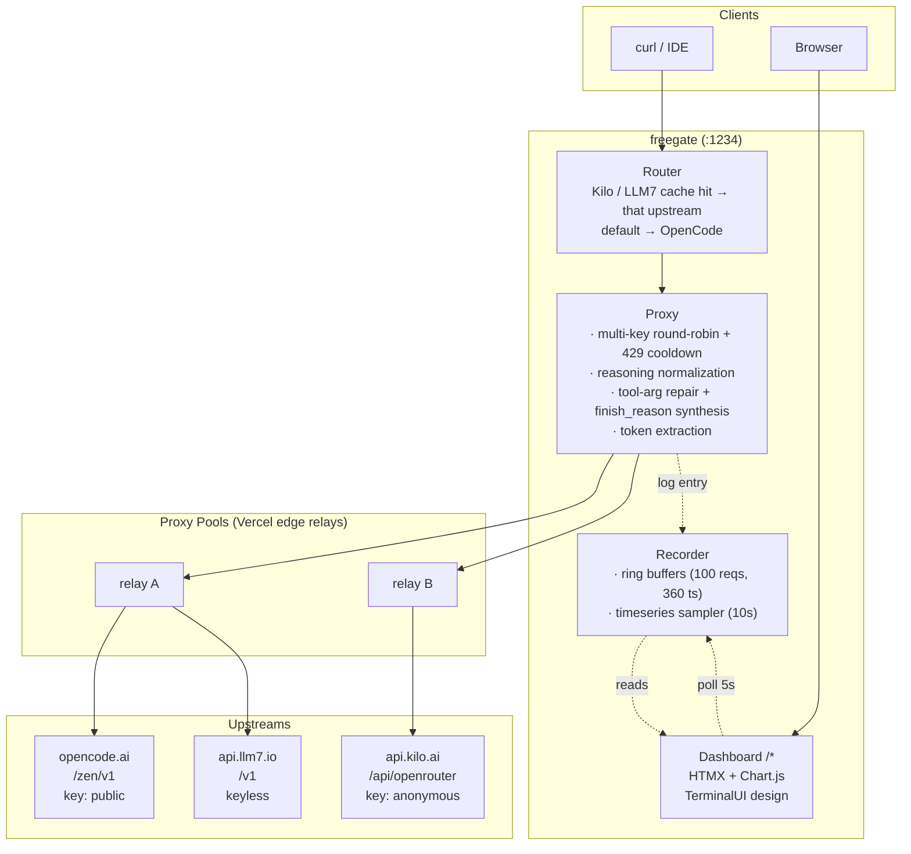

# freegate

Multi-upstream OpenAI-compatible API proxy for free AI models, routed through Vercel edge-relay proxy pools.

freegate proxies `/v1/chat/completions`, `/v1/messages` (Anthropic-native), `/v1/responses` (OpenAI Responses API), and `/v1/models` requests to **opencode.ai**, **kilo.ai** (OpenRouter), and **api.llm7.io** (keyless gateway), routing each request to the upstream that serves the requested model. Upstream traffic goes through enabled proxy pools (Vercel edge relays, round-robin via `x-relay-target` / `x-relay-path` headers) or direct when no pool is enabled. Only free models are served. Streaming responses normalize the upstream's `reasoning_content` field (used by OpenCode/DeepSeek) into the standard `reasoning` field so clients see a single reasoning field.

## Features

- **Multi-upstream routing** — a model is served by Kilo or LLM7 iff it appears in that upstream's free catalog (`isFree == true` for Kilo; not usage-based / `turbo` tier for LLM7, both from the upstream's `/models` response); everything else falls through to OpenCode
- **Free only** — automatically filters out paid models (`isFree == true` for Kilo, `-free` suffix for OpenCode — same convention opencode uses in its own catalog); merged & deduped on `/v1/models`
- **Proxy pools** — upstream traffic routes through enabled Vercel edge-relay pools (round-robin, `x-relay-target` / `x-relay-path`); direct when no pool is enabled — no automatic IP rotation on 429
- **Reasoning normalization** — collapses upstream `reasoning_content` (OpenCode/DeepSeek) into a single `reasoning` field, preventing the double-response seen on DeepSeek when both fields are present
- **DeepSeek DSML handling** — recovers orphaned DSML tool-call blocks into real tool calls, strips leaked DSML scaffolding from text, and stops DeepSeek tool requests at the tool_calls closer instead of letting the model re-emit blocks to `max_tokens`
- **Format translation** — accepts OpenAI, Claude (`/v1/messages`), and Gemini request formats, plus the Responses API (`/v1/responses`); detects and translates requests to the upstream OpenAI format, then translates responses back
- **Token counting** — prompt/completion/total tokens extracted from upstream responses, displayed in dashboard
- **Rate limiting** — per-IP rate limiter, configurable via env
- **Admin + API auth** — dashboard requires `ADMIN_TOKEN` (login form / cookie or header); `/v1/*` accepts a DB-managed client key (created at `/settings` or `POST /api/api-keys`), the admin token, or the admin login cookie (`Authorization: Bearer <key>` / `X-API-Key: <key>` / cookie)
- **Custom providers** — any OpenAI-compatible base URL + keys in SQLite (`PROVIDERS_DB_PATH`), managed at `/providers` or `/api/providers` (keys masked, test probe, live rebuild, no restart)
- **Tiered combos** — combos are virtual models: `model=hemat` tries Tier1→Tier2→Tier3 in order, failing over on transport errors, 429s, 5xx, and free-tier rejections (one same-tier retry first); managed at `/providers` or `/api/combos`, listed in `/v1/models` as `combo:<name>`
- **Terminal-style dashboard** — HTMX + Chart.js monitoring UI at `http://localhost:1234/` with a phosphor-green-on-black aesthetic, JetBrains Mono typeface, and purposeful zero-radius design
- **Chat playground** — in-dashboard chat UI with model picker, system prompt, and persistent thread; opens from the nav and posts to the same `/v1/chat/completions` proxy, with SSE streaming (default), a stop button, and one-shot non-streaming mode
- **Mobile responsive** — dashboard adapts to small screens with a compact grid layout
- **Docker Compose** — single command to start the proxy
- **Single binary** — `freegate` per OS (linux/darwin/windows)

## Quick Start

```bash
./freegate --port 1234
```

**Docker:**
```bash
docker compose up -d
```

The proxy will be available at `http://localhost:1234`.

## Proxy Pools

Upstream requests route through enabled proxy pools in round-robin order. Each pool is a Vercel edge relay (`proxy_url` = `https://<relay>`); freegate rewrites the request to the relay and injects `x-relay-target` (upstream scheme+host) and `x-relay-path` (upstream path+query). Requests matching a pool's `no_proxy` list bypass the relay. With no enabled pool, traffic goes direct.

Manage pools at `/providers` (# Proxy Pools) or via `/api/pools` (CRUD, admin-only). Pool changes rebuild live — no restart.

A read-only terminal-style dashboard is served at **`http://localhost:1234/`** — see [Dashboard](#dashboard) below.

## Usage

```bash
# List available free models
curl http://localhost:1234/v1/models

# Chat completion (streaming)
curl -X POST http://localhost:1234/v1/chat/completions \
  -H "Content-Type: application/json" \
  -d '{"model":"openrouter/owl-alpha","messages":[{"role":"user","content":"hello"}],"max_tokens":50}'

# Chat completion (non-streaming)
curl -X POST http://localhost:1234/v1/chat/completions \
  -H "Content-Type: application/json" \
  -d '{"model":"deepseek-v4-flash-free","messages":[{"role":"user","content":"hello"}],"stream":false}'

# Responses API (native)
curl -X POST http://localhost:1234/v1/responses \
  -H "Content-Type: application/json" \
  -d '{"model":"muse-spark-1.3-contributor-free","input":"hello"}'

# Health check
curl http://localhost:1234/ready

# Anthropic-native (Claude format) — auto-translated to the upstream
curl -X POST http://localhost:1234/v1/messages \
  -H "Content-Type: application/json" \
  -H "anthropic-version: 2023-06-01" \
  -d '{"model":"claude-sonnet-4","max_tokens":50,"messages":[{"role":"user","content":"hello"}]}'


## Routing Rules

A model ID is served by:
- **Combo** — exact-name match on a tiered combo first (`model=hemat` → Tier1→Tier2→Tier3, failover on transport errors/429s/5xx/free-tier rejections, with one same-tier retry on transport errors)
- **Custom provider** — if the model was explicitly selected for a custom provider (dashboard checkboxes from the probe; only stored models route)
- **Kilo** — if Kilo's free catalog contains it (`isFree == true`)
- **LLM7** — if LLM7's free catalog contains it (keyless gateway; free = not usage-based or `turbo` tier)
- **OpenCode** — everything else (default upstream)

The catalog is refreshed periodically from each upstream, so routing is driven
by upstream truth, not by a hard-coded prefix list.

## Configuration

All settings are environment variables (`internal/config/config.go:Load` is source of truth):

| Variable | Default | Description |
|----------|---------|-------------|
| `PORT` | `1234` | Server port |
| `LOG_LEVEL` | `info` | Log level: `debug`, `info`, `warn`, `error` |
| `ADMIN_TOKEN` | — | **Required** (>=6 chars). Admin password: gates the dashboard (login form at `/login`, cookie `fg_admin` or `X-Admin-Token`/`Bearer` header) and also works as a superset key for `/v1/*`. Generate: `openssl rand -hex 32` |
| `RATE_LIMIT` | `60` | Requests per minute per IP |
| `TRUST_PROXY_HEADERS` | `false` | Honor `X-Forwarded-For` / `X-Real-IP` for client IP (rate limiting, logs). Leave `false` when exposed directly — forwarded headers are spoofable. Set `true` only behind a reverse proxy that overwrites them. |
| `UPSTREAM_URL_OPENCODE` | `https://opencode.ai/zen/v1` | OpenCode upstream URL |
| `UPSTREAM_KEY_OPENCODE` | `public` | OpenCode API key |
| `UPSTREAM_OPENCODE_FREE_ALLOWLIST` | `big-pickle` | Comma-separated model IDs that are free on the OpenCode upstream but don't carry the `-free` suffix |
| `UPSTREAM_URL_KILO` | `https://api.kilo.ai/api/openrouter` | Kilo upstream URL |
| `UPSTREAM_KEY_KILO` | `anonymous` | Kilo API key |
| `UPSTREAM_URL_LLM7` | `https://api.llm7.io/v1` | LLM7 keyless gateway URL |
| `UPSTREAM_DEFAULT` | `opencode` | Default upstream for unmatched models (`opencode`, `kilo`, or `llm7`) |
| `UPSTREAM_REFRESH_OPENCODE` | `60` | Model refresh interval for OpenCode (seconds) |
| `UPSTREAM_REFRESH_KILO` | `60` | Model refresh interval for Kilo (seconds) |
| `UPSTREAM_REFRESH_LLM7` | `300` | Model refresh interval for LLM7 (seconds) |
| `RESPONSE_MODELS` | `muse-spark,muse_spark` | Comma-separated substrings routing models to the Responses API |
| `MESSAGE_MODELS` | `union-alpha` | Comma-separated substrings routing models to the Messages API |
| `UPSTREAM_CAPTURE` | `false` | Log raw upstream request/response lines via slog (debug only — contains full conversation content) |
| `PROVIDERS_DB_PATH` | `./data/providers.db` | SQLite file for custom providers, tiered combos, and seeded auth + upstream settings. Auto-created; local files are restricted to `0600` and their directory to `0700` on startup. |

Custom providers, combos, pools, and seeded auth/upstream settings live in SQLite and are managed at `/providers` or via `/api/providers`, `/api/combos`, `/api/pools` (no restart needed).

## API Endpoints

| Method | Path | Description |
|--------|------|-------------|
| `GET` | `/v1/models` | List all free models from all upstreams (merged, deduped) |
| `POST` | `/v1/chat/completions` | OpenAI-compatible chat completions (also accepts Claude, Gemini, and Responses formats) |
| `POST` | `/v1/messages` | Claude-native endpoint (auto-translated to OpenAI upstream) |
| `POST` | `/v1/responses` | Responses API endpoint (muse-spark and friends) |
| `GET` | `/v1/metrics` | Request metrics (counts per upstream, errors, tokens) |
| `GET` | `/ready` | Health check |
| `GET` | `/` | Terminal-style monitoring dashboard (see below) |
| `GET` | `/providers` | Custom providers + tiered combos management UI (admin-only) |
| `GET/POST` | `/api/providers`, `/api/providers/{id}`, `/api/providers/{id}/test` | Custom provider CRUD + live `/models` probe (admin-only, keys masked) |
| `GET/POST` | `/api/combos`, `/api/combos/{id}`, `/api/combos/{id}/test` | Tiered combo CRUD + per-tier probe (admin-only) |
| `GET/POST` | `/api/pools`, `/api/pools/{id}` | Proxy pool CRUD (admin-only, rebuilds live) |

### Format Translation

freegate accepts **OpenAI**, **Claude** (`/v1/messages`), **Gemini**, and **Responses** request formats on `/v1/chat/completions`, plus native `/v1/messages` and `/v1/responses` endpoints. Incoming requests are detected and translated to the upstream OpenAI format; responses are translated back. Both streaming and non-streaming responses are supported.

Detection is structural (no URL path needed) and ordered:

1. **Gemini** — top-level `contents` array with no `messages` key
2. **Claude** — `messages` plus a Claude-specific hint (`anthropic_version`, top-level `max_tokens`, a `system` prompt, or `tool_use` / `tool_result` / `image` content blocks)
3. **Responses** — top-level `input` with no `messages` key
4. **OpenAI** — default

### Request Limits & Middleware

- **Request body limit:** 10 MB (`MaxRequestBodySize` in `internal/delivery/handler/chat.go`); oversized bodies are rejected with HTTP 413.
- **CORS:** wildcard `Access-Control-Allow-Origin: *` plus `OPTIONS` short-circuit on every route, so browser clients can call the proxy from any origin.
- **Request ID:** every request gets an `X-Request-ID` (echoed if the client sent one, otherwise an 8-byte hex value); included in logs and the recent-requests table.
- **Response header:** `X-Fg-Normalized` lists which request normalizations fired (e.g. `deepseek-flash-top-p`, `deepseek-tool-stop`).
- **Error format:** OpenAI-compatible `{"error":{"type","message"}}` envelope used for all `4xx` / `5xx` responses.

### Reasoning Normalization

OpenCode and DeepSeek stream their reasoning tokens in the `reasoning_content` field; OpenRouter/Kilo use `reasoning`. freegate collapses both into a single `reasoning` field so the client only ever sees one:

```json
{
  "choices": [{
    "message": {
      "content": "Final answer here",
      "reasoning": "Step-by-step thought process..."
    }
  }]
}
```

This applies to both streaming (`delta`) and non-streaming (`message`) responses. The upstream `reasoning_content` is always dropped, so clients that render `reasoning` (or `reasoning_content`) do not see the thinking text twice.

## Dashboard

A lightweight, embedded terminal-style dashboard is served at **`http://localhost:1234/`** (mounted at the root). It uses HTMX for live partial updates and Chart.js for the timeseries line chart — no JavaScript framework, no SPA, no database. Everything is in-memory and embedded into the single Go binary.

### Design

The dashboard follows the **TerminalUI** design system:
- Dark canvas (`#0D0D0D`), phosphor green (`#00FF41`) brand accent
- **JetBrains Mono** throughout — self-hosted WOFF2 in four weights (400 / 500 / 600 / 700)
- Zero border radius on all elements
- Borders and dashed ASCII-style dividers instead of shadows for hierarchy
- Transparent buttons that invert (green text → green background on hover)
- Uppercase pill badges with colored borders
- CLI comment `//` prefix on descriptions and `$` / `#` prefixes on headings
- All transitions are instant (`step-start`, no easing curves)

### Features

- **Stat blocks** — total requests, upstream errors, total tokens (auto-refresh 5s)
- **Requests/min chart** — line chart of the last 1 hour (10s samples, ×6 to convert to per-minute)
- **Upstream split** — per-upstream counts with proportional bars
- **Free Models table** — filter by provider, auto-refresh 10s
- **Recent Requests** — last 100 proxied requests (timestamp, model, upstream, status, duration, tokens, IP, error), auto-refresh 5s
- **API Endpoints card** — quick reference for available REST endpoints
- **Health badge** — green square dot when models are loaded, amber when empty
- **Mobile responsive** — adapts layout for small screens (compact nav grid, 2-col metrics, tighter spacing)

### Endpoints used by the dashboard

| Path | Description |
|------|-------------|
| `GET /` | HTML dashboard (server-rendered initial state) |
| `GET /providers` | HTML providers / combos / proxy-pool admin page |
| `GET /settings` | HTML client API key management page |
| `GET /partials/stats` | HTMX partial: 4 metric cards (requests, errors, input/output tokens) |
| `GET /partials/requests` | HTMX partial: last 100 proxied requests table |
| `GET /partials/models` | HTMX partial: free-models table with provider filter |
| `GET /api/timeseries` | JSON: `[{ts, total_requests, errors, per_upstream}]` |
| `GET /api/health` | JSON: `{ok, uptime, started_at, has_models, model_count}` |
| `GET /static/*` | Self-hosted static assets (CSS, HTMX, Chart.js, JetBrains Mono, favicon) |
| `GET /index.html` | Redirects to `/` |

### Notes

- **Admin login required.** The dashboard is behind `ADMIN_TOKEN` (`/login`). The Docker compose file binds the proxy port to `127.0.0.1:1234` so it is not exposed to the network by default; `GET /ready` stays public for health probes.
- **In-memory only (metrics).** All counters and request history are lost on restart. The ring buffers hold at most 100 recent requests and 360 timeseries samples (1 hour at 10s cadence).
- **SQLite persistence (config).** Custom providers, tiered combos, and seeded auth + upstream settings persist in `PROVIDERS_DB_PATH` (default `./data/providers.db`). Mount a volume over `./data` in docker or the file is lost with the container.
- **Client keys replaced `API_KEY`.** `/v1/*` credentials are DB-managed: create them at `/settings` (or `POST /api/api-keys`). The `API_KEY` env var was **removed** — a stale value in `.env` is ignored (the server logs `warn: API_KEY is no longer supported` on boot) and keys from it no longer authenticate, so create a client key at `/settings` before upgrading clients.

## Playground

The dashboard includes an embedded **chat playground** — a modal chat UI served by the same `web/static/js/playground.js` bundle that the dashboard already loads. Open it from the **> playground** button in the nav.

- **Model picker** — populated from `GET /v1/models` (auto-loaded on first open; refreshes on demand)
- **System prompt** — collapsible; persists with the thread in `localStorage`
- **Stream toggle** — switches between SSE streaming (default) and one-shot responses; a stop button aborts an in-flight stream while keeping the partial answer
- **Multi-turn thread** — keep the conversation going; full history is sent with each request
- **Persistence** — the thread survives page reloads via `localStorage` (key: `freegate.playground.v1`); "clear" wipes it
- **Shortcuts** — `Enter` sends, `Shift+Enter` inserts a newline
- **Admin-only dashboard** — the dashboard requires `ADMIN_TOKEN` login. The playground calls `/v1/chat/completions` with the same credentials: after dashboard login the `fg_admin` cookie authorizes it automatically; external clients use a DB client key (created at `/settings` or `POST /api/api-keys`) or the admin token via `Authorization: Bearer <key>` / `X-API-Key: <key>`

Internally the dashboard polls HTMX fragments (`/partials/stats`, `/partials/upstreams`, `/partials/requests`, `/partials/models`) while Alpine owns interactive state: modals, the model-test flow, the playground chat component, and the providers admin client. The playground send path uses **fetch directly**: streaming mode consumes the OpenAI SSE response with a ReadableStream reader and appends delta text incrementally, with automatic fallback to buffered rendering when SSE or streams are unavailable; non-streaming mode waits for the full JSON. The modal markup lives in `web/templates/partials/playground_modal.html` (rendered into `dashboard.html` via a `{{template}}` directive), the Alpine component in `web/static/js/playground.js`, and the model picker loads `/v1/models` as JSON.

## Architecture


```mermaid
flowchart TB
    subgraph Clients["Clients"]
        CLI["curl / IDE"]
        Browser["Browser"]
    end

    subgraph Freegate["freegate (:1234)"]
        Router["Router<br/>Kilo / LLM7 cache hit → that upstream<br/>default → OpenCode"]
        Proxy["Proxy<br/>· multi-key round-robin + 429 cooldown<br/>· reasoning normalization<br/>· tool-arg repair + finish_reason synthesis<br/>· token extraction"]
        Dashboard["Dashboard /*<br/>HTMX + Chart.js<br/>TerminalUI design"]
        Recorder["Recorder<br/>· ring buffers (100 reqs, 360 ts)<br/>· timeseries sampler (10s)"]
    end

    subgraph Pools["Proxy Pools (Vercel edge relays)"]
        P1["relay A"]
        P2["relay B"]
    end

    subgraph Upstreams["Upstreams"]
        OC["opencode.ai<br/>/zen/v1<br/>key: public"]
        Kilo["api.kilo.ai<br/>/api/openrouter<br/>key: anonymous"]
        LLM7["api.llm7.io<br/>/v1<br/>keyless"]
    end

    CLI --> Router
    Router --> Proxy
    Proxy --> P1
    Proxy --> P2
    P1 --> OC
    P2 --> Kilo
    P1 --> LLM7
    Proxy -.->|"log entry"| Recorder
    Recorder -.->|"reads"| Dashboard
    Browser --> Dashboard
    Dashboard -.->|"poll 5s"| Recorder
```

## Project Structure

```
freegate
├── cmd/server/main.go        # Entry point
├── internal/
│   ├── application/          # Use cases: ChatService (routing, failover, metrics), ModelService
│   ├── config/               # Env-based config with validation
│   ├── delivery/             # HTTP-facing layer
│   │   ├── handler/          # HTTP handlers: Chat, ListModels, Ready, Metrics
│   │   ├── middleware/       # Logging, auth, rate limit, CORS, request ID
│   │   ├── respond/          # Shared HTTP response utilities
│   │   └── ui/               # Dashboard: HTMX handlers, templates, static assets
│   ├── domain/               # Core domain types (ChatRequest, Upstream, UpstreamRouter, etc.)
│   ├── httputil/             # HTTP helpers: header parsing, IP extraction, conversion
│   ├── infrastructure/       # Integrations
│   │   ├── metrics/          # Request counters + token tracking
│   │   ├── proxy/            # Upstream-agnostic normalization helpers
│   │   ├── recorder/         # Request log + timeseries sampler
│   │   ├── ringbuffer/       # Generic typed ring buffer
│   │   └── upstream/         # Upstream interface + Router + implementations (opencode, kilo, llm7) + edge-relay pools
│   ├── server/               # HTTP server bootstrap (wiring + lifecycle)
│   └── translate/            # Format translation: detect + Claude/Gemini/Responses convert, DeepSeek normalize, DSML sanitize
├── web/                      # Embedded assets (templates, CSS, JS, fonts)
│   ├── templates/
│   │   ├── dashboard.html    # Main page (includes playground modal via {{template}})
│   │   └── partials/         # HTMX partial fragments (stats, requests, models, playground modal + playground model options)
│   ├── static/
│   │   ├── css/app.css       # TerminalUI design system
│   │   ├── js/               # Vendored HTMX 2.x + Chart.js 4.x + playground.js
│   │   ├── fonts/            # Self-hosted JetBrains Mono (Latin, 4 weights)
│   │   └── favicon.svg       # Terminal-style favicon
│   └── embed.go              # go:embed directives
├── docker-compose.yml        # Single proxy container
├── Dockerfile                # Multi-stage Go build
├── Makefile                  # test, build, docker compose targets
└── .env.example              # Environment variable reference
```

## Development

A `Makefile` wraps the common workflows. Run `make help` for the full list.

```bash
# Common targets
make test         # run all tests
make test-v       # run tests (verbose)
make test-cover   # run tests with coverage report (writes coverage.html)
make test-race    # run tests with the race detector
make test-one name=TestFoo  # run a single test by name
make build        # build the server binary -> ./server
make run          # run the server locally
make vet          # go vet
make fmt          # gofmt
make check        # fmt + vet + test
make tidy         # go mod tidy

# Docker Compose
make up             # docker compose up -d
make down           # docker compose down
make restart        # docker compose restart
make logs svc=proxy # tail a service's logs
make ps             # list running services
make ps-all         # list all services including stopped
make rebuild svc=proxy  # rebuild and restart a service
make compose-build  # build service images
make compose-pull   # pull service images
make clean          # docker compose down -v + remove build artifacts
```

The same targets are also available directly:

```bash
# Build
go build -o server ./cmd/server

# Test
go test ./... -count=1

# Build Docker
docker compose build
```

## Tech Stack

- **Go 1.26+** — core proxy server
- **[chi](https://github.com/go-chi/chi/v5)** — HTTP router
- **Vercel edge relays** — proxy pools (`x-relay-target` / `x-relay-path`)
- **Docker Compose** — orchestration
- **HTMX 2.x + Chart.js 4** — embedded dashboard (no JS framework, no SPA)
- **JetBrains Mono** — terminal-inspired monospace typeface (self-hosted WOFF2)
- **TerminalUI** — green-on-black design system (zero radius, no shadows, instant transitions)

## Disclaimer

This project is not affiliated with OpenAI, OpenCode.ai, Kilo.ai, or any other upstream provider. It is a personal tool that routes requests to publicly available free-tier API endpoints. Users are responsible for complying with each upstream provider's terms of service. The software is provided "as is", without warranty of any kind.
