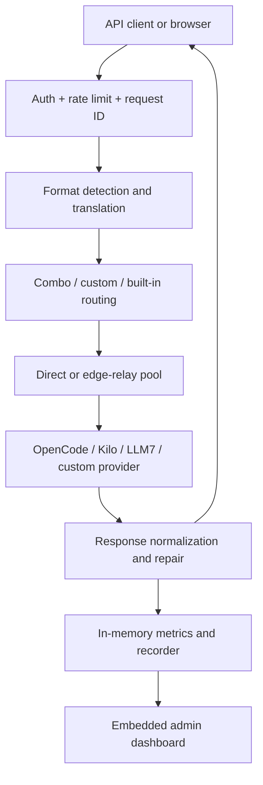

# freegate

**OpenAI-compatible proxy for free AI models across multiple upstreams.**

freegate provides one authenticated API for OpenAI Chat Completions, Anthropic Messages, OpenAI Responses, and model discovery. Requests are translated to the selected upstream's format, sent through an optional edge-relay pool, and translated back to the caller's format.

Built-in upstreams:

- **OpenCode** — `https://opencode.ai/zen/v1`
- **Kilo / OpenRouter** — `https://api.kilo.ai/api/openrouter`
- **LLM7** — `https://api.llm7.io/v1`
- **Custom providers** — any OpenAI-compatible provider managed in SQLite

The proxy exposes free-model catalogs, tracks request metrics in memory, and includes an authenticated dashboard for providers, routing combos, relay pools, and client API keys.

## Features

- **Multi-format API** — OpenAI, Claude, Gemini, and Responses request/response translation
- **Native endpoints** — `/v1/chat/completions`, `/v1/messages`, `/v1/responses`, and `/v1/models`
- **Free-model filtering** — provider catalogs are refreshed and paid models are excluded
- **Custom providers** — manage OpenAI-compatible endpoints, keys, headers, and model selections
- **Tiered combos** — virtual models that fail over across configured upstreams
- **Edge-relay pools** — round-robin Vercel-style relays with `no_proxy` bypass rules
- **Response repair** — reasoning-field normalization, tool-call argument repair, and DSML cleanup
- **Streaming support** — SSE and non-streaming responses
- **Authentication** — required admin login plus database-managed client API keys
- **Rate limiting** — configurable per-IP request limit
- **Operations UI** — embedded terminal-style dashboard, health checks, metrics, and request history
- **Single binary** — static Go build with embedded web assets

## Requirements

- Go **1.26+**
- Docker and Docker Compose for the container workflow, or
- A local Go toolchain for source builds

## Quick start

### Local binary

```bash
cp .env.example .env
# Set ADMIN_TOKEN in .env, for example:
# ADMIN_TOKEN=$(openssl rand -hex 32)

make run
```

The server listens on `http://localhost:1234` by default. Open the dashboard at:

```text
http://localhost:1234/
```

To build and run the binary explicitly:

```bash
make build
./bin/freegate --port 1234
```

The `--port` flag overrides `PORT`.

### Docker Compose

To build and run the local source tree:

```bash
cp .env.example .env
# Set ADMIN_TOKEN in .env

docker compose up -d --build
```

Useful compose commands:

```bash
make up             # docker compose up -d
make logs svc=proxy # follow proxy logs
make ps             # show service status
make down           # stop services
```

The compose service binds to `127.0.0.1:1234` by default. Put a TLS reverse proxy in front of it before exposing it beyond the local machine.

## Authentication

`ADMIN_TOKEN` is required and must contain at least six characters. Generate one with:

```bash
openssl rand -hex 32
```

The dashboard and admin APIs accept:

- `X-Admin-Token: <ADMIN_TOKEN>`
- `Authorization: Bearer <ADMIN_TOKEN>`
- The authenticated `fg_admin` cookie created by the login form

The `/v1/*` API requires one of:

- A database-managed client key created at `/settings`
- A client key sent as `Authorization: Bearer <key>` or `X-API-Key: <key>`
- `ADMIN_TOKEN` as a superset credential
- The `fg_admin` admin cookie

The old `API_KEY` environment variable is no longer supported. If it is present, freegate logs a warning and ignores it.

`GET /ready` is intentionally public for container and orchestration health probes. All other dashboard, settings, and admin routes require admin authentication.

## API usage

Set the base URL and a client credential:

```bash
export FREEGATE_URL=http://localhost:1234
export FREEGATE_KEY=fg_replace_with_a_client_key
```

### List models

```bash
curl "$FREEGATE_URL/v1/models" \
  -H "Authorization: Bearer $FREEGATE_KEY"
```

Model IDs are dynamic because catalogs are refreshed from upstream providers. Choose a model from the response rather than assuming a particular ID is still available.

### Chat Completions

```bash
curl -N "$FREEGATE_URL/v1/chat/completions" \
  -H "Authorization: Bearer $FREEGATE_KEY" \
  -H "Content-Type: application/json" \
  -d '{
    "model": "<model-id>",
    "messages": [{"role": "user", "content": "Hello"}],
    "stream": true
  }'
```

Set `"stream": false` for a regular JSON response.

### Anthropic Messages

```bash
curl "$FREEGATE_URL/v1/messages" \
  -H "Authorization: Bearer $FREEGATE_KEY" \
  -H "Content-Type: application/json" \
  -H "anthropic-version: 2023-06-01" \
  -d '{
    "model": "<model-id>",
    "max_tokens": 128,
    "messages": [{"role": "user", "content": "Hello"}]
  }'
```

### Responses API

```bash
curl -N "$FREEGATE_URL/v1/responses" \
  -H "Authorization: Bearer $FREEGATE_KEY" \
  -H "Content-Type: application/json" \
  -d '{
    "model": "<model-id>",
    "input": "Hello"
  }'
```

### Health and metrics

```bash
curl "$FREEGATE_URL/ready"
curl "$FREEGATE_URL/v1/metrics" \
  -H "Authorization: Bearer $FREEGATE_KEY"
```

## Routing

Routing is evaluated in this order:

1. **Tiered combo** — an exact combo name is tried first. Each tier is attempted in order, with failover for transport errors, rate limits, server errors, and upstream free-tier failures.
2. **Custom provider** — a model explicitly selected for an enabled custom provider routes to that provider.
3. **Built-in router** — Kilo is checked for a free-catalog match, then LLM7; OpenCode is the final fallback. Built-in model catalogs are refreshed in the background.

Catalogs are refreshed in the background. A newly configured custom provider is rebuilt live, and newly selected models can be warmed immediately through the provider test flow; no restart is required.

## API endpoints

### Public and client endpoints

| Method | Path | Description |
|---|---|---|
| `GET` | `/ready` | Readiness probe; returns `503` until a model catalog is loaded |
| `GET` | `/v1/models` | Merged free-model catalog |
| `GET` | `/v1/metrics` | In-memory request, error, upstream, and token metrics |
| `POST` | `/v1/chat/completions` | Chat Completions API; also accepts detected Claude, Gemini, and Responses bodies |
| `POST` | `/v1/messages` | Anthropic Messages API |
| `POST` | `/v1/responses` | OpenAI Responses API |

### Dashboard

| Method | Path | Description |
|---|---|---|
| `GET` | `/` | Monitoring dashboard |
| `GET` | `/providers` | Provider, combo, and relay-pool management |
| `GET` | `/settings` | Client API key management |
| `GET` | `/partials/stats` | Dashboard statistics fragment |
| `GET` | `/partials/upstreams` | Upstream usage fragment |
| `GET` | `/partials/requests` | Recent requests fragment |
| `GET` | `/partials/models` | Model catalog fragment |
| `GET` | `/api/timeseries` | Dashboard time-series JSON |
| `GET` | `/api/health` | Dashboard health JSON |

### Admin APIs

All routes below are admin-only.

| Area | Routes |
|---|---|
| Providers | `GET/POST /api/providers`, `GET/PUT/DELETE /api/providers/{id}`, `POST /api/providers/{id}/test`, `POST /api/providers/probe` |
| Combos | `GET/POST /api/combos`, `PUT/DELETE /api/combos/{id}`, `POST /api/combos/{id}/test` |
| Relay pools | `GET/POST /api/pools`, `GET/PUT/DELETE /api/pools/{id}`, `POST /api/pools/{id}/test`, `POST /api/pools/vercel-deploy` |
| Built-in proxy settings | `GET /api/builtin-proxies`, `PUT /api/builtin-proxies/{name}` |
| Client keys | `GET/POST /api/api-keys`, `PUT/DELETE /api/api-keys/{id}`, `POST /api/api-keys/{id}/reveal` |

## Format translation

Incoming requests are detected structurally and converted to the format expected by the selected upstream. Responses are converted back to the requested client format.

Detection precedence for body-based requests is:

1. **Responses** — top-level `input` without `messages`
2. **Gemini** — top-level `contents` without `messages`
3. **Claude** — `messages` with a Claude-specific field or content block
4. **OpenAI** — default

The endpoint path is authoritative for the native routes: `/v1/messages` is Claude, `/v1/responses` is Responses, and `/v1/chat/completions` is OpenAI-compatible chat.

## Normalization and request handling

- Request bodies are limited to **10 MB**; oversized bodies receive `413`.
- `reasoning_content` is normalized into the standard `reasoning` field where appropriate.
- Tool-call argument fragments are repaired and emitted as valid tool-call events.
- Leaked DSML/tool scaffolding is removed from user-visible text.
- Normalization details are exposed in the `X-Fg-Normalized` response header.
- Every request receives an `X-Request-ID`; client-provided IDs are preserved.
- Errors use an OpenAI-compatible JSON envelope.
- CORS allows browser clients from any origin. Use a trusted reverse proxy and TLS when exposing the service publicly.
- Raw upstream capture is disabled by default because it can log full conversation content.

## Configuration

Configuration is loaded from environment variables. `internal/config/config.go` is the implementation source of truth; `.env.example` contains an annotated template.

### Server and security

| Variable | Default | Description |
|---|---:|---|
| `PORT` | `1234` | HTTP port; must be between `1` and `65535` |
| `LOG_LEVEL` | `info` | `debug`, `info`, `warn`, or `error` |
| `ADMIN_TOKEN` | — | **Required**, at least 6 characters; admin password and API superset key |
| `RATE_LIMIT` | `60` | Requests per minute per client IP; must be positive |
| `TRUST_PROXY_HEADERS` | `false` | Trust `X-Forwarded-For` / `X-Real-IP`; enable only behind a proxy that overwrites them |

### Built-in upstreams

| Variable | Default | Description |
|---|---|---|
| `UPSTREAM_URL_OPENCODE` | `https://opencode.ai/zen/v1` | OpenCode base URL |
| `UPSTREAM_KEY_OPENCODE` | `public` | Comma-separated OpenCode bearer keys; keys are rotated per request |
| `UPSTREAM_OPENCODE_FREE_ALLOWLIST` | `big-pickle` | Comma-separated free model IDs without the `-free` suffix |
| `OPENCODE_CLIENT_VERSION` | auto | Optional OpenCode client version advertised to the gateway |
| `UPSTREAM_URL_KILO` | `https://api.kilo.ai/api/openrouter` | Kilo base URL |
| `UPSTREAM_KEY_KILO` | `anonymous` | Kilo bearer key |
| `UPSTREAM_URL_LLM7` | `https://api.llm7.io/v1` | LLM7 base URL |
| `UPSTREAM_REFRESH_OPENCODE` | `60` | OpenCode catalog refresh interval in seconds |
| `UPSTREAM_REFRESH_KILO` | `60` | Kilo catalog refresh interval in seconds |
| `UPSTREAM_REFRESH_LLM7` | `300` | LLM7 catalog refresh interval in seconds |
| `UPSTREAM_DEFAULT` | `opencode` | Fallback setting retained in configuration; the current built-in router uses OpenCode as its default |

### Routing and persistence

| Variable | Default | Description |
|---|---|---|
| `RESPONSE_MODELS` | `muse-spark,muse_spark` | Case-insensitive model substrings routed to the Responses API |
| `MESSAGE_MODELS` | `union-alpha` | Case-insensitive model substrings routed to the Messages API |
| `UPSTREAM_CAPTURE` | `false` | Log raw upstream requests and responses; contains full conversation content |
| `PROVIDERS_DB_PATH` | `./data/providers.db` | SQLite database for custom providers, combos, pools, and client keys |

See [`docs/ENV.md`](docs/ENV.md) for the complete environment-variable reference and [`docs/RUNBOOK.md`](docs/RUNBOOK.md) for deployment and recovery procedures.

## Dashboard and playground

The dashboard is embedded in the binary and served at `/`:

- Live request, error, token, and upstream statistics
- Request-per-minute time series for the previous hour
- Last 100 requests, including model, status, duration, tokens, client IP, and errors
- Free-model catalog with provider filtering
- Client key and provider management
- Terminal-style dark UI with responsive layouts

The **Playground** provides a local multi-turn chat interface with model selection, system prompts, SSE streaming, non-streaming mode, stop/cancel, and browser persistence. It uses the same `/v1/chat/completions` endpoint as external clients.

Metrics and recent request history are in memory and reset on restart. Configuration and managed provider state persist in SQLite at `PROVIDERS_DB_PATH`; mount `/data` when using Docker.

## Architecture


```mermaid
flowchart TB
    Client[API client or browser] --> Auth[Auth + rate limit + request ID]
    Auth --> Translate[Format detection and translation]
    Translate --> Router[Combo / custom / built-in routing]
    Router --> Relay[Direct or edge-relay pool]
    Relay --> Upstream[OpenCode / Kilo / LLM7 / custom provider]
    Upstream --> Normalize[Response normalization and repair]
    Normalize --> Client
    Normalize --> Metrics[In-memory metrics and recorder]
    Metrics --> Dashboard[Embedded admin dashboard]
```

## Project structure

```text
cmd/server/                 Application entry point
internal/application/       Chat and model use cases
internal/config/             Environment loading and validation
internal/delivery/           HTTP handlers, middleware, admin APIs, and UI
internal/domain/             Core domain types
internal/httputil/           HTTP and header helpers
internal/infrastructure/     Providers, proxy, metrics, recorder, and upstreams
internal/server/             Dependency wiring and HTTP lifecycle
internal/translate/          OpenAI, Claude, Gemini, Responses, and DSML translation
web/                         Embedded templates, CSS, JavaScript, and fonts
docs/                         Environment, adapters, runbook, and contributing guides
```

## Development

```bash
make help              # list all targets
make test              # run all tests
make test-v            # run tests verbosely
make test-cover        # generate coverage.out and coverage.html
make test-race         # run the race detector
make test-one name=TestFoo
make build             # build ./bin/freegate
make run               # run from source
make vet               # run go vet
make fmt               # format Go source
make check             # fmt + vet + test
make tidy              # tidy Go modules
```

Useful direct commands:

```bash
go test ./... -count=1
go build -o bin/freegate ./cmd/server
go run ./cmd/server
```

Static web assets are embedded at build time. After changing templates or static files, restart the server or rebuild the binary. If the Tailwind source is changed, regenerate the compiled CSS with:

```bash
npm --prefix web/assets install
make css
```

## Documentation

- [`docs/ENV.md`](docs/ENV.md) — environment variables and security notes
- [`docs/ADAPTERS.md`](docs/ADAPTERS.md) — Claude Code and Codex CLI integration
- [`docs/RUNBOOK.md`](docs/RUNBOOK.md) — deployment, health checks, troubleshooting, and rollback
- [`docs/CONTRIBUTING.md`](docs/CONTRIBUTING.md) — development conventions and testing
- [`.env.example`](.env.example) — configuration template

## Disclaimer

freegate is an independent personal tool. It is not affiliated with OpenAI, OpenCode, Kilo, LLM7, or any other upstream provider. Use of free upstream APIs is subject to each provider's terms, availability, and usage policies. The software is provided “as is,” without warranty of any kind.
